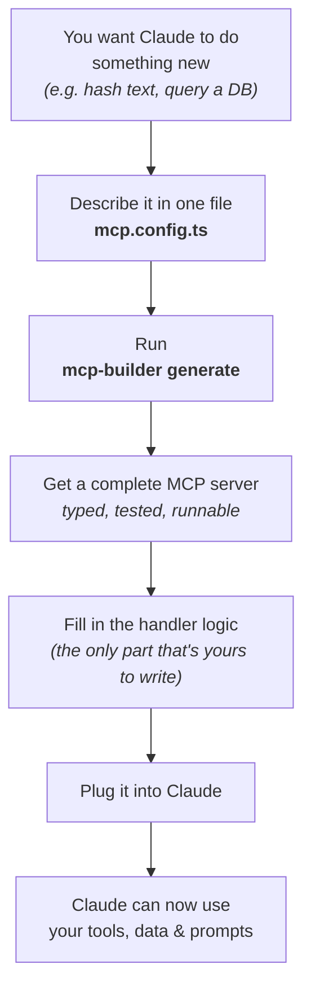
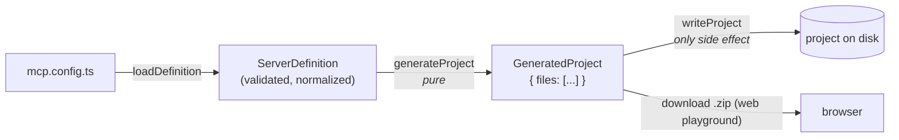

<div align="center">

<picture>
  <source media="(prefers-color-scheme: dark)" srcset="assets/logo-dark.svg">
  
</picture>

<p><strong>Declare your tools, resources, and prompts. Get a typed, tested, runnable MCP server in seconds.</strong></p>

<p>
  
  
  
  
</p>

</div>

---

## What is this?

### New to MCP? Start here

AI assistants like Claude are powerful, but on their own they cannot run your code, read your database, or call your API. The [Model Context Protocol](https://modelcontextprotocol.io) (MCP) is the standard way to give them those abilities. Think of it as **a USB port for AI**: you build a small program (an "MCP server") that plugs in and exposes three kinds of things:

- **Tools** — actions the assistant can take ("hash this text", "create a ticket").
- **Resources** — data it can read ("the contents of this file", "today's metrics").
- **Prompts** — ready-made instructions it can reuse ("review this code").

Writing one of these servers by hand means a lot of repetitive plumbing: schemas, type definitions, validation, wiring, tests, config. **`mcp-builder` writes all of that for you** from a short description, so you only fill in the actual logic.

### The idea in one picture



### What you actually get

`mcp-builder` turns a single declarative file into a complete MCP server: one module per capability, real [Zod](https://zod.dev) schemas, an inferred type for every handler, a smoke test, and a README with the Claude wiring already filled in.

It is **not** a static template you clone and edit by hand. You describe *what your server exposes*, and the generator writes the project for you. Same input, same output, every time (the generation is pure and snapshot-tested).

```text
mcp.config.ts            →   mcp-builder generate   →   a typed MCP server project
(you declare capabilities)   (deterministic codegen)    (compiles, tests, runs, connects to Claude)
```

### How it compares

| Approach | Example | What you get |
| --- | --- | --- |
| Static scaffolder | `create-typescript-server` | An empty server shell + one sample tool. You write every capability by hand. |
| OpenAPI wrapper | `openapi-mcp-generator` | An MCP server wrapping an API you *already* have. |
| **mcp-builder** | this project | A server generated from a typed declaration of the capabilities you *want*, with schemas, types, and tests. |

---

## Quickstart

```bash
# 1. Install (in the workspace that holds your mcp.config.ts)
pnpm add -D @mcp-builder/core
npm install -g mcp-builder        # or run it with npx

# 2a. Generate from an existing definition
mcp-builder generate mcp.config.ts

# 2b. ...or scaffold one interactively
mcp-builder init
```

A definition is plain, typed TypeScript:

```ts
// mcp.config.ts
import { defineServer } from "@mcp-builder/core";

export default defineServer({
  name: "dev-utils",
  version: "0.1.0",
  description: "A small toolbox of offline developer utilities, exposed over MCP.",
  transport: "stdio", // or "http" for Streamable HTTP
  tools: [
    {
      name: "hash_text",
      description: "Compute a cryptographic hash of a string.",
      input: {
        text: { type: "string", description: "The text to hash." },
        algorithm: {
          type: "enum",
          values: ["sha256", "sha512", "md5"],
          default: "sha256",
        },
      },
    },
  ],
  resources: [
    { name: "about", uri: "dev-utils://about", description: "Server metadata." },
  ],
  prompts: [
    {
      name: "code_review",
      description: "Ask Claude to review a snippet of code.",
      arguments: { code: {}, language: { optional: true } },
    },
  ],
});
```

Tool inputs are declared as **data**, not live Zod objects. That keeps a definition fully serializable (TypeScript today, JSON or a web form tomorrow), while the generator emits real Zod source into the server.

Running `mcp-builder generate` prints:

```text
› Loading definition from mcp.config.ts
✔ Generated 12 files in dev-utils
  • .gitignore
  • package.json
  • README.md
  • src/index.ts
  • src/prompts/code_review.ts
  • src/resources/about.ts
  • src/tools/hash_text.ts
  • test/server.test.ts
  • tsconfig.json
  • vitest.config.ts

Next steps
  • cd dev-utils
  • npm install
  • npm run build
  • npm run inspect   # explore the server in the MCP Inspector
```

---

## What gets generated

```text
dev-utils/
├── src/
│   ├── index.ts              # createServer() + transport wiring (stdio or http)
│   ├── tools/<name>.ts       # Zod input shape + inferred type + handler stub
│   ├── resources/<name>.ts   # read callback stub
│   └── prompts/<name>.ts     # args shape + handler stub
├── test/server.test.ts       # smoke test (server builds with all capabilities)
├── package.json              # pinned MCP SDK + zod, build/start/inspect/test scripts
├── tsconfig.json             # strict, NodeNext ESM
├── vitest.config.ts
└── README.md                 # how to build, inspect, and connect to Claude
```

Each tool module is fully typed end to end:

```ts
// src/tools/hash_text.ts
import { z } from "zod";

export const inputShape = {
  text: z.string().describe("The text to hash."),
  algorithm: z.enum(["sha256", "sha512", "md5"]).default("sha256"),
} satisfies z.ZodRawShape;

export type Input = z.infer<z.ZodObject<typeof inputShape>>;

export async function handler(input: Input) {
  // input.algorithm is typed as "sha256" | "sha512" | "md5"
  // TODO: implement
}
```

You fill in the `TODO` handler bodies. Everything around them (schemas, types, registration, transport, tests) is written for you.

---

## Connect to Claude

The generated `README` includes the exact config. For a stdio server, build it then add it to Claude Desktop's `claude_desktop_config.json` (use an **absolute** path):

```json
{
  "mcpServers": {
    "dev-utils": {
      "command": "node",
      "args": ["/ABSOLUTE/PATH/TO/dev-utils/dist/index.js"]
    }
  }
}
```

Restart Claude Desktop and your tools, resources, and prompts appear in the client. To exercise the server without Claude, use the [MCP Inspector](https://github.com/modelcontextprotocol/inspector): `npm run inspect`.

A working example, verified against a real MCP client handshake, lives in [`examples/dev-utils-server`](examples/dev-utils-server):

```text
TOOLS: hash_text, generate_uuid, format_json
RESOURCES: dev-utils://about
PROMPTS: code_review
hash_text(hello): 2cf24dba5fb0a30e26e83b2ac5b9e29e1b161e5c1fa7425e73043362938b9824
OK: full MCP handshake succeeded
```

---

## Architecture

The engine is a **deep module with a small interface**. `generateProject` is pure (definition in, files out, no file system), so the CLI, the test suite, and a future web UI all share one seam. `writeProject` is the single place that touches disk.



The public surface of `@mcp-builder/core` is five functions:

```ts
defineServer(input)        // typed authoring helper for mcp.config.ts
parseDefinition(raw)       // validate + normalize, throws ValidationError
loadDefinition(path)       // load an mcp.config.ts via jiti, then parse
generateProject(def, opts) // pure: definition → in-memory files
writeProject(project, dir) // the only file-system boundary
```

---

## Monorepo layout

```text
mcp-builder/
├── packages/
│   ├── core/   # @mcp-builder/core — schema, codegen, generator (no I/O)
│   └── cli/    # mcp-builder — thin CLI over core (generate + init)
├── apps/
│   └── web/    # Next.js playground — same core, in the browser
├── examples/
│   ├── dev-utils.config.ts   # the example definition
│   └── dev-utils-server/     # the generated + implemented server
└── docs/
    └── definition-format.md  # full reference for the definition schema
```

### Web playground

The CLI and the web UI are both thin adapters over the same pure `core`, which is exactly what the architecture was designed to make cheap. The playground (`apps/web`, Next.js App Router + Tailwind) lets you edit a JSON or YAML definition, preview every generated file, download the project as a `.zip`, and export a typed `mcp.config.ts`, with no duplicated generation or parsing logic.

```bash
pnpm --filter @mcp-builder/web dev   # http://localhost:3000
```

---

## Development

```bash
pnpm install
pnpm build      # tsc -b across packages
pnpm test       # vitest (schema, codegen, generator snapshots)
pnpm lint       # biome
pnpm check      # lint + build + test
```

| Decision | Choice | Why |
| --- | --- | --- |
| Language | TypeScript (strict, NodeNext ESM) | End-to-end types are the product. |
| Validation | Zod | Same library the MCP SDK uses. |
| Generated-code formatting | Prettier | Output stays clean regardless of templates; deterministic for snapshots. |
| Repo tooling | Biome | One fast tool for lint + format. |
| Build | `tsc` project references | No bundler needed for a library + CLI. |

---

## Roadmap

- [x] CLI `generate` and `init`, stdio + Streamable HTTP transports
- [x] Pure, snapshot-tested core
- [x] TypeScript, JSON, and YAML definitions
- [x] Web playground that consumes the same `core` to generate and download a server
- [ ] Optional output validation against the MCP Inspector in CI

---

## License

[MIT](LICENSE) © Alexander Hills
